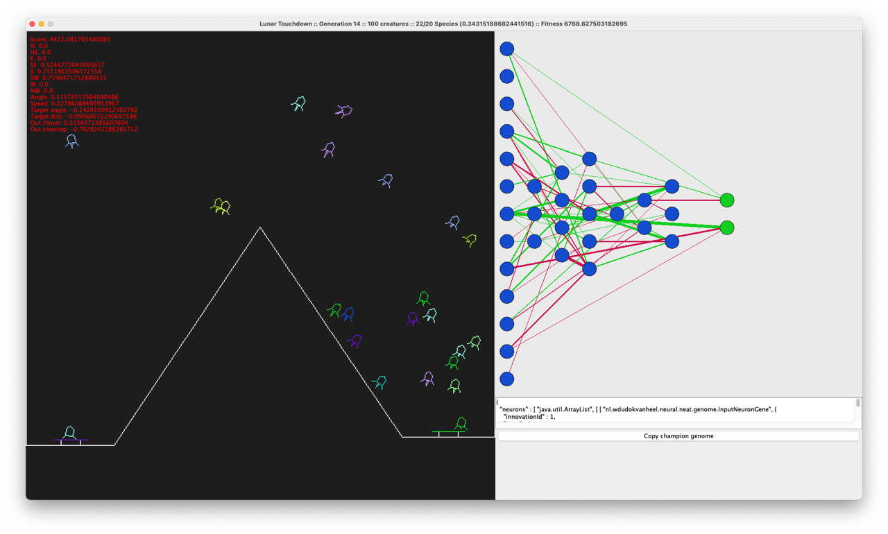
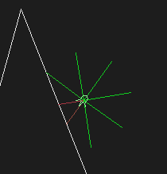

# NEAT Lunar Lander

This module integrates the NEAT library to play a lunar lander simulation. The goal of the simulation is to
fly the lander from the purple starting point to the green target, making a soft landing. The height and shape
of the hill is randomized each run.



## Lander input/output

Each lander has 13 inputs nodes:
- 8 short sensors that can detect objects nearby (N, NE, E, SE, S, SW, W, NW) 
- Angle of the lander
- Speed of the lander
- Angle to the target
- Distance to the target
- Static bias

And each lander has 2 output nodes it can manipulate
- Thrust of the engine
- Steering of the lander



*Visualization of the input sensors*

## Success rate

This project is still under development and the best genome evolved has a success rate of 75%. In the resources folder
you'll find various genomes, the filenames indicate their success rate.


## Project structure

* **Game logic** (`nl.wdudokvanheel.neat.lunar.game`): physics, collision detection, scoring, and world update loop, 
  singleplayer mode.
* **Model** (`nl.wdudokvanheel.neat.lunar.game.model`): lander, level, vector, and collision classes.
* **Scoring** (`nl.wdudokvanheel.neat.lunar.game.logic.score`): waypoint and target scoring
* **NEAT core** (`nl.wdudokvanheel.neural.neat`): genome definitions, evolution context, and configuration.
* **UI** (`nl.wdudokvanheel.neat.lunar.game.ui`): rendering panel, network info, and genome serialization
* **Simulation** (`nl.wdudokvanheel.neat.lunar.simulation`):
    * `LunarNeat` — Runs full NEAT evolution loop
    * `SingleGenomeBenchmark` — Benchmarks a single genome from the clipboard

## How to run

Requires Maven to compile and run the applications

To run the NEAT evolution
```bash
mvn compile exec:java@neat
```

To benchmark a single genome (make sure it's on your clipboard/copy-paste buffer)

```bash
mvn compile exec:java@benchmark
```

To play for yourself

```bash
mvn compile exec:java@singleplayer
```
 
## Controls

### For the simulation & benchmark

* **P**: Pause/Resume simulation
* **1/2/3/4/5**: Set simulation speed to 1×, 2×, 4×, 8×, or 16×
* **N**: Toggle graphics rendering (for faster evolution)
* **S** Fast forward to the end of the current generation
* **R** Restart the complete evolution
* **P** Read a genome from your clipboard and restart the simulation

### For single player

* **Space** Thrust
* **A** Steer to the left
* **D** Steer to the right